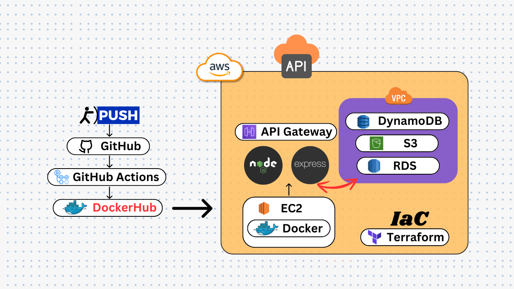

# Building and Deploying a Node.js + Express API with AWS Services Using Terraform and GitHub Actions

## Key Components

### 1. Node.js + Express.js
- Node.js: A JavaScript runtime environment.
- Express.js: A minimalist web framework for Node.js, ideal for building RESTful APIs.

### 2. AWS Services
- S3: Amazon Simple Storage Service for storing and retrieving any amount of data.
- DynamoDB: A key-value and document database with single-digit millisecond performance.
- RDS: Amazon Relational Database Service for operating and scaling relational databases.
- EC2: Amazon Elastic Compute Cloud for hosting Dockerized applications.
- API Gateway: Amazon API Gateway for creating, publishing, and securing APIs.

### 3. Terraform
- An open-source Infrastructure as Code (IaC) tool for provisioning AWS resources.

### 4. Docker
- A platform for developing, shipping, and running applications inside containers.

### 5. GitHub Actions
- A CI/CD service for automating software workflows directly from GitHub repositories.

## Workflow Overview

1. **Code Commit:** Developers push changes to a specified branch in the GitHub repository.
2. **CI/CD Pipeline:** GitHub Actions triggers, checking out code, installing dependencies, running tests, building a Docker image, and pushing it to DockerHub.
3. **Deployment:** The EC2 instance pulls the latest Docker image from DockerHub, stops the previous container, and runs the new one.
4. **Accessing the API:** Users interact with the API through Amazon API Gateway, routing requests to the Node.js application running inside Docker on the EC2 instance.

